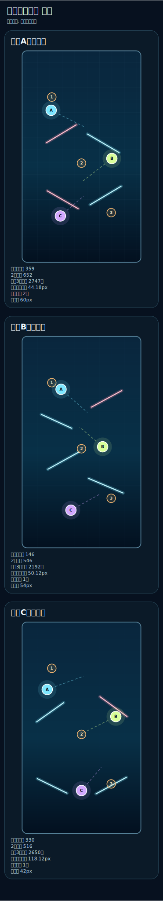
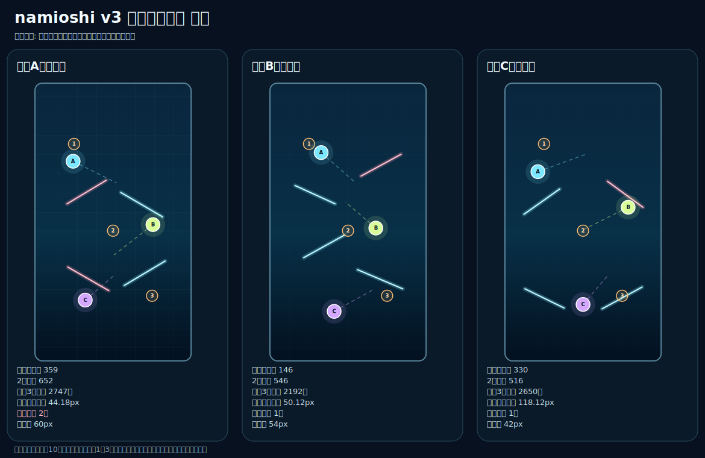

# namioshi v3 公式配置 選定ガイド

- 対象: Phase 3B後の人間判断
- 基準main: `dd49724d236c2573e38baf8d7ecf99475983a060`
- 候補データ版: `namioshi-v3-layout-study-001`
- 現在の採用状態: `human-decision-pending`
- 本番ゲームへの反映: なし

この文書は、候補A・B・CをGitHub上で見比べ、次の実装へ進む候補を人が決めるための資料です。ここで書く「優先候補」は推薦であり、採用決定ではありません。

## 1. スマートフォン向け比較画像



横並びで確認する場合は、次の画像を開いて拡大してください。



画像の見方は次のとおりです。

- A・B・Cの丸は3つのビーコンです。破線は10秒間の移動経路です。
- 水色の線はガラス片です。桃色の線はビーコンとの近接警告があるガラス片です。
- 橙色の1・2・3は、全候補へ同じ条件で使った比較用タップ地点です。

## 2. 数値で確認できた事実

| 指標 | 候補A・交差流 | 候補B・段流路 | 候補C・開港型 |
|---|---:|---:|---:|
| ガラス反射経路 | 359 | 146 | 330 |
| 2回反射経路 | 652 | 546 | 516 |
| 共通3タップ参考得点 | 2747 | 2192 | 2650 |
| ビーコン同士の最小間隔 | 44.18px | 50.12px | 118.12px |
| ビーコンとガラスの近接警告 | 2件 | 1件 | 1件 |
| ガラス端点の画面端からの最小余白 | 60px | 54px | 42px |

この数値は、同じ121地点、同じ56到達時刻、同じ3タップ地点で調べた結果です。実際の面白さや見やすさを直接測った値ではありません。

## 3. 各候補の読み取り

### 候補A・交差流

反射経路は最も多く、複雑な攻略を作りやすい候補です。一方で、ビーコン同士の最小間隔が44.18pxと狭く、ビーコンとガラスの近接警告も2件あります。情報量が多くなりやすいため、初回の公式配置として使うには、実機で重なり方を慎重に確認する必要があります。

### 候補B・段流路

画面の流れは読みやすく、反射経路が一地点へ集中しにくい候補です。ただし、ガラス反射経路が146で、候補Aの359、候補Cの330よりかなり少なくなっています。namioshiの中心である「ガラス片を使った反射」を体験しにくくなる可能性があります。

### 候補C・開港型

ビーコン同士の最小間隔が118.12pxで、3候補の中では最も離れています。ガラス反射経路は330あり、候補Aに近い数を保っています。共通3タップ参考得点も2650で、候補Aの2747に近い水準です。

注意点は、ガラス端点の画面端からの最小余白が42pxで、3候補の中では最も小さいことです。iPhone SE級で端のガラス片を見分けられるかは、実機確認が必要です。

## 4. 現時点の推薦

**初回の実機確認へ進める優先候補は、候補C・開港型です。**

これは次の事実を合わせて判断した意見です。

1. ビーコン同士が最も離れており、3つを見分けやすい可能性が高い。
2. ガラス反射経路が330あり、ガラス反射を使うゲーム性を残しやすい。
3. 共通3タップ参考得点が2650で、反射による高得点の余地を保っている。
4. 近接警告が1件で、候補Aより少ない。

ただし、42pxの端余白が実機で狭いと確認された場合は、候補Cをそのまま採用せず、ガラス片を内側へ寄せた候補Dを作って再比較します。

## 5. 選ばない場合の理由

候補Aを選ぶ場合は、近接警告2件と狭いビーコン間隔を受け入れる理由が必要です。

候補Bを選ぶ場合は、ガラス反射経路が少なくても、段階的な読みやすさを優先する理由が必要です。

候補Dを追加する場合は、候補Cの見やすさを保ちながら、端余白を広げる修正を主目的にします。候補Dの作成は別Pull Requestで行い、同じ分析条件へ通します。

## 6. 選定後に行うこと

候補を選んだ後は、選定記録だけを別Pull Requestで確定します。そのPull Requestでは、次を記録します。

- 採用候補ID
- 候補指紋
- ルール版
- 採用理由
- 実機確認の有無
- 残っている注意点

選定記録がmainへ反映された後、Phase 3Cで公式モードと練習モードを分けます。

## 7. 返答形式

次のいずれかを明示してください。

```text
候補Aを採用
候補Bを採用
候補Cを採用
候補Dを追加して再比較
```

候補を選ぶまでは、公式配置を本番コードへ入れず、ランキング対象にも切り替えません。
